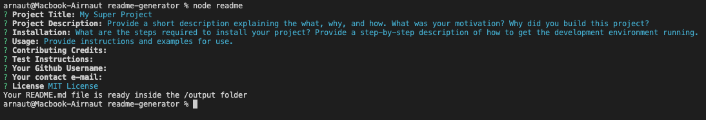
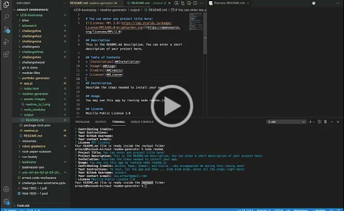

# 09 A README generator using Node.JS
[](https://www.gnu.org/licenses/gpl-3.0)

## Description
This is a quick Node.JS app that creates a README.md based on user prompts. This is a command-line app asks for information to create a more-or-less "standard" README file.

## Table of Contents
* [Installation](#Installation)
* [Usage](#Usage)
* [License](#License)
* [Credits](#Credits)
* [Test instructions](#TestInstructions)
* [Questions](#Questions)

## Installation
The full logic is contained in the readme.js file. In order to run this file, you'll need to download it and run it via command line:
``` 
node readme
```

## Usage
This app uses [FS](https://nodejs.org/api/fs.html) and [INQUIRER](https://www.npmjs.com/package/inquirer). The latter will have to be installed in order to use readme.js.

First install inquirer:
```
npm install inquirer
```
Now run readme.js:
``` 
node readme
```
It will prompt you to enter the sections of the README.md file to create:



Check the app working here:

[](https://drive.google.com/file/d/1Q31AQOBvszRTV4haOjXnZOjeFo-YuY87/preview)

## License

[](https://www.gnu.org/licenses/gpl-3.0)
GNU General Public License v3.0

## Credits

Wickie, Dawn, Summer, and Gloria - Girls5eva and Tina Fey who accompanied me during this coding sesh.

## Test Instructions

To test, follow the [Usage](##Usage) instructions and create your own README.md. This app will create an /output folder, where the README.md will be created.

## Questions
E-mail me: <lou.arnaut@gmail.com>
Checkout my Github profile: [acevezl](https://github.com/acevezl)
